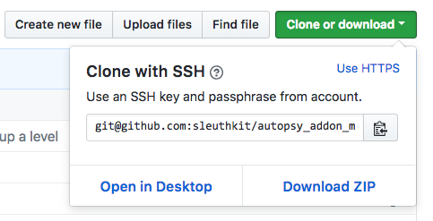

# Autopsy 3rd Party Module Repository

This repository contains the 3rd party add-on modules to the [Autopsy Digital Forensics Platform](http://www.autopsy.com). Each module has a folder in the repository that contains a README file. Some of the modules are stored in this repository and others are hosted on another site with a link in its README.

How To Use The Site:
1. Find the module that meets your needs
2. Download and install it

# Finding A Module 

The modules in the repository are organized by their type. 
- **Ingest modules** analyze files as they are added to the case.  This is most common type of module.
- **Content viewer modules** are in the lower right corner of Autopsy and they display a file or selected item in some way.
- **Report modules** run at the end of the analysis and can generate various types of reports (or can do various types of analysis).
- **Data source processors** allow for different types of data sources to be added to a case. 

Each module has its own folder with a README.md file that outlines the basics of what the module does. 

You can either navigate the folder structure or use the [Search](https://sleuthkit.github.io/autopsy_addon_modules/) page that will search the contents of the README files.

# Downloading A Module 

Once you've found a module, you need to get it.  You have two choices for doing that. 

1. Make a copy of this repository by downloading a ZIP file of it.  You can do this by clicking on "Clone or download" and then "Download ZIP".  
 

2. You can download specific modules from the site.  This is easier for Java NBM modules than it is for Python modules, which may contain a number of files. 

# Installing a Module 

Instructions for installing a module can be found here: http://sleuthkit.org/autopsy/docs/user-docs/latest/module_install_page.html

# Updating this Site 
If you are a developer and want your module listed on here, then please refer to the 
[Instructions for Developers](DocsForDevelopers/DeveloperInstructions.md).

